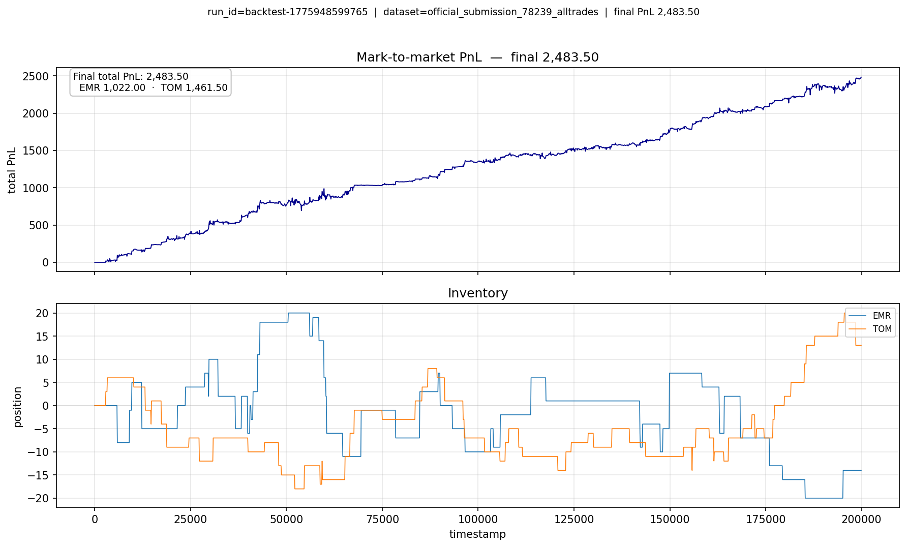

# Prosperity 4 - Team LXYZ (solo)

This repo includes my workflow scripts, tools, and research for the **IMC Prosperity 4 (2026)** competition.

**Note:** It currently houses the **Tutorial Round 1** processes. Later rounds will get their own folders as each is completed.

## What is Prosperity?
Prosperity is a trading competition where players earn **"XIRECS"** by building their own systems. Each round introduces new products with unique properties resembling real-world assets; products from previous rounds remain tradable, making it a game of finding alpha and optimizing strategies.

Each round provides the traders "data capsules" that contain sample data about the different tradable products. Data analysis is required to understand the price dynamics and identify patterns to develop profitable trading strategies for each product. The trading strategies are written in **Python** and must abide by the rules set by IMC. 

Players submit their code which is run by IMC's simulations and then receive their results, often as a PnL curve graph. Players must read the guidelines of each round to ensure their strategies comply with the rules and constraints imposed on each product and strategies.

## Repo Structure

Each round folder will hold that round's **trader**, **data** (extracted/clean CSVs, submission logs, exports), **tools** (pipelines and helpers), and any notes or results snapshots for writeups.

Right now only **Tutorial Round 1** exists, under [`TUT_ROUND_1/`](TUT_ROUND_1/README.md):

| Path | Purpose |
|------|---------|
| [`TUT_ROUND_1/`](TUT_ROUND_1/README.md) | Trader (`trader.py`, `datamodel.py`), `pyproject.toml`, setup |
| `TUT_ROUND_1/data/` | Tutorial and submission datasets (`tutorial/`, `submissions/<id>/`) |
| `TUT_ROUND_1/tools/` | Unified CLI: pipelines, log export, plots, dashboards (`python -m tools`) |
| `TUT_ROUND_1/scripts/` | e.g. `visualize_bundle.py` for plotting a backtester `bundle.json` |
| `TUT_ROUND_1/results/` | Figures embedded in this README |

## Results

<h2>Tutorial Round 1</h2>

  
<h3>Algo</h3>

- **Fair value** - Emeralds: mid near **10,000** when inside a tight band, else follow mid; Tomatoes: book mid (fallback anchor).
- **Quotes** — One bid and one ask per product per tick from fair, with integer **max buy** / **min sell** bounds; lift through the book and join the queue when it improves fills.
- **Inventory** — Per-product **limits**; **skew** fair toward flattening when size grows; optional **extra ticks** at the bounds to reduce position near limits.
- **Tomatoes** — On very wide spreads, quote slightly **less aggressive** to keep edge.
- **Crossing** — Optional rule: only **lift asks** when not long and only **hit bids** when not short (passive quotes unchanged); replay PnL was unchanged vs baseline on tested logs.

<h3>Results (local replay)</h3>

Replay of submission **78239** against the tutorial-style book + tape (`official_submission_78239_alltrades`). **Not** an official leaderboard result.

| | XIRECS |
|--|--:|
| **Total PnL** | 2,483.50 |
| EMERALDS | 1,022.00 |
| TOMATOES | 1,461.50 |

Mark-to-market PnL and inventory (positions stay within configured limits; the two products are quoted **independently**, so inventories can move in opposite directions as fills differ per book):

## Acknowledgments

- Thanks to the **Prosperity / IMC Community**
- **[chrispyroberts](https://github.com/chrispyroberts)** for his [IMC Prosperity 3 | Lessons & Analysis Youtube Video](https://www.youtube.com/watch?v=PI2lJ063sJ8) and his [IMC Prosperity 3 Writeup](https://github.com/chrispyroberts/imc-prosperity-3)

Third-party backtesters and visualizers are optional and not vendored here in my repo.  

- **[prosperity_rust_backtester](https://github.com/GeyzsoN/prosperity_rust_backtester)** - Rust backtester used locally for fast replay and `bundle.json` outputs.  
- **[imc-prosperity-3-visualizer](https://github.com/jmerle/imc-prosperity-3-visualizer)** - charting / visualization dashboard
- **[Prosperity / IMC documentation](https://imc-prosperity.notion.site/prosperity-4-wiki)** - rules, datamodels, and competition context.
- **[Prosperity 4 Visualizer](https://prosperity.equirag.com/)** - community charting / visualization dashboard